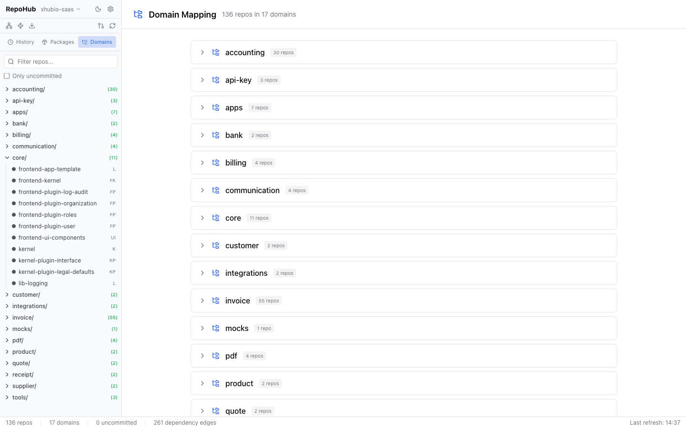
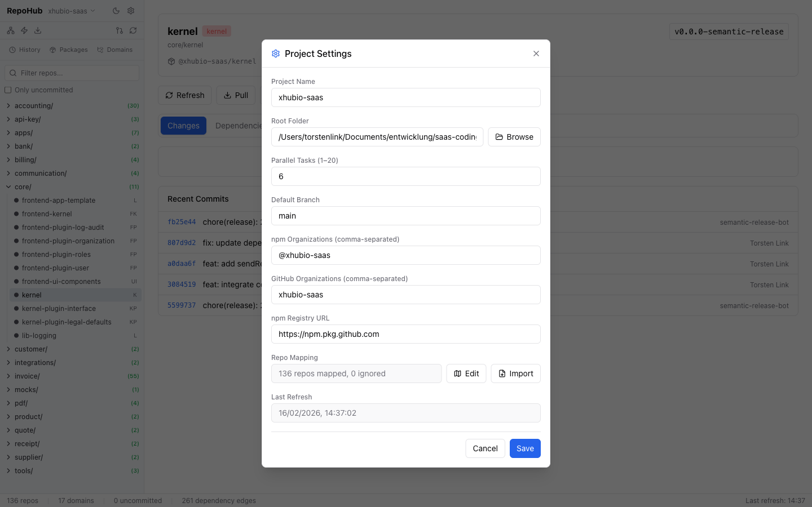
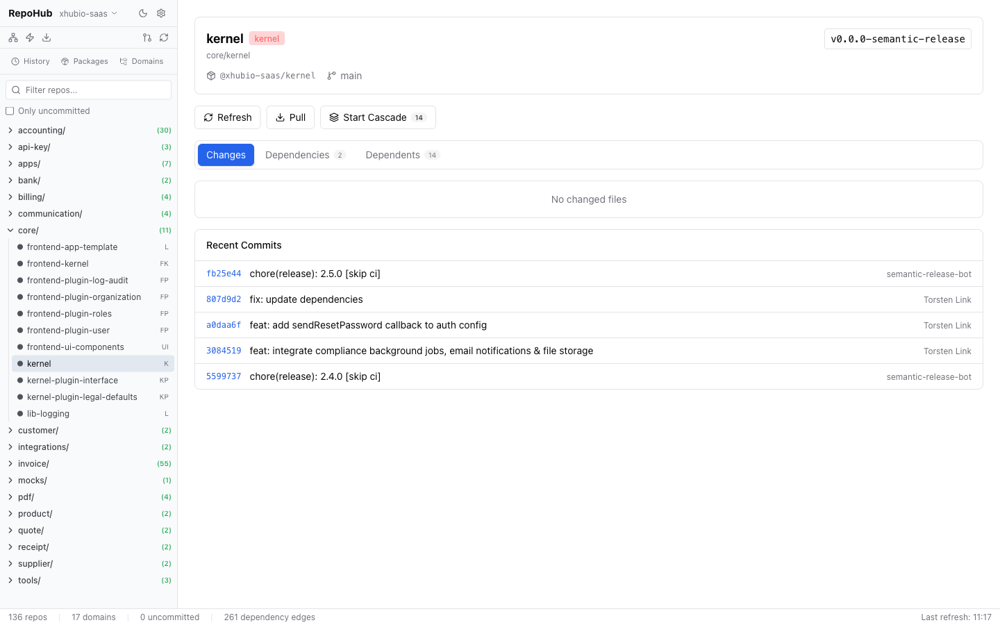
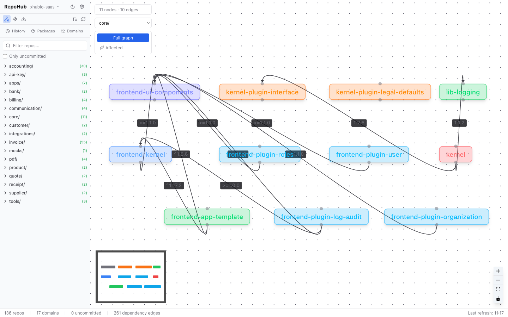
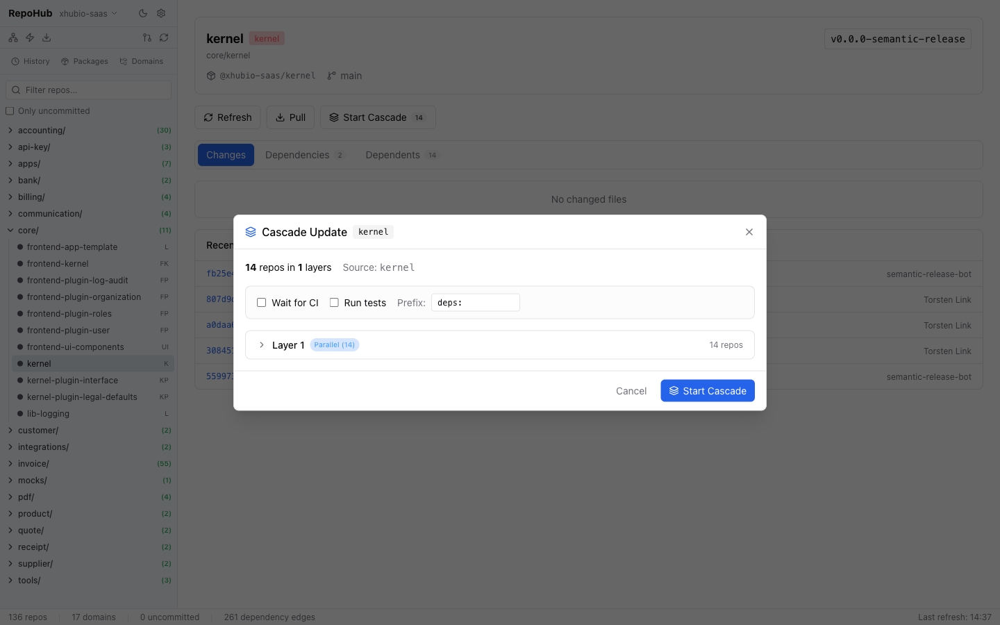
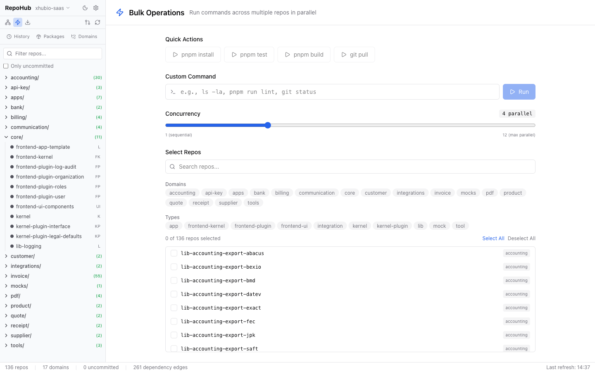

# RepoHub

Web-based dashboard for managing multi-repo monorepos. Provides dependency graph visualization, cascade updates, bulk operations, and Git management across all your packages.



## Features

- **Dashboard** with repo statistics and domain overview
- **Interactive dependency graph** visualization with domain filtering
- **Cascade updates** — propagate dependency changes through the entire chain
- **Pull All** — clone/pull all repos from GitHub in parallel
- **Bulk operations** — run shell commands across multiple repos
- **Repository detail** with diff viewer, dependencies, commit & push
- **File-URL dependency management** — switch between `file:` and npm versions
- **Persistent operation history** for cascade and pull-all runs

## Installation

```bash
npm install -g @aikotools/repo-maintenance
```

## Quick Start

1. Run `repohub`
2. Open http://localhost:3100
3. Click the gear icon (Settings) and configure:
   - **Project Name** — a label for your monorepo
   - **Root Folder** — path to the directory containing all your repos
   - **npm Organizations** — scoped packages to detect as internal deps (e.g. `@myorg`)
   - **GitHub Organizations** — for Pull All operations (e.g. `myorg`)
   - **Parallel Tasks** (1–20, default: 6)
   - **Default Branch** (e.g. `main`)
4. Click **"Refresh repo structure"** to scan your repos



## Prerequisites

| Tool | Version | Purpose |
|------|---------|---------|
| **Node.js** | 24+ | Runtime |
| **Git** | — | Repository operations |
| **GitHub CLI (`gh`)** | — | Pull All (clone + GitHub queries) |

GitHub CLI must be authenticated (`gh auth login`).

## Feature Details

### Repository Detail

Click on any repo in the sidebar to open the detail view:

- **Changes tab** — modified files with diff viewer. Untracked files can be added to `.gitignore` with one click.
- **Dependencies tab** — internal dependencies with links to the respective repo.
- **Dependents tab** — repos that depend on this repo.
- **Actions** — Refresh, Pull, Start Cascade.
- **Recent Commits** — last commits for the repo.



### Dependency Graph

Interactive visualization of all internal dependencies as a node-edge graph (React Flow). Filter by domain, toggle between full graph and affected-only views. Click on a node to navigate to the repo detail.



### Pull All

Synchronizes all repos with GitHub:

1. Fetches all repos from the configured GitHub organization via `gh repo list`
2. **Clones** missing repos into the correct domain folder
3. **Pulls** existing repos (skips repos with uncommitted changes)
4. Shows live progress with per-repo status

**Status types:**

| Status | Meaning |
|--------|---------|
| Updated | Successfully pulled |
| Already up-to-date | No changes |
| Cloned | Newly cloned from GitHub |
| Skipped | In ignore list |
| Unmapped | No domain mapping configured |
| Has changes | Skipped due to uncommitted changes |
| Failed | Error during pull/clone |

**Repo mapping:** Settings > Repo Mapping > Edit. Assign repos to domains, ignore repos, or map unmapped repos.

### Cascade Updates

Propagates dependency updates automatically through the entire dependency chain.

**Example:** `lib-core` is updated. Cascade automatically updates all dependent packages in the correct order (topologically sorted, layer by layer).

**Workflow:**

1. Select source repo (e.g. `lib-core`)
2. Tool calculates all affected repos in topological order
3. Configure options:
   - **Wait for CI** — wait between layers for CI/CD to publish
   - **Run Tests** — run tests before committing
   - **Commit Prefix** — e.g. `deps: ` or `chore: `
4. Review the plan and start



**Per repo, the cascade executes:**

1. Update `package.json` dependencies
2. `npm install`
3. Run tests (optional)
4. Commit + Push
5. Wait for CI (optional) + resolve published version

**Controls during execution:** Pause, Resume, Abort, Skip Failed, manually set version.

### Bulk Operations

Run arbitrary shell commands across multiple repos in parallel:

1. Filter repos by domain, type, or search term
2. Enter a command (e.g. `npm run build`, `git status`, `npm test`)
3. Choose concurrency (1–20)
4. Start — live output per repo with exit code and duration



### Packages (File-URL Management)

Shows repos with `file:` dependencies in `package.json`. Enables batch switching between local `file:` paths (development) and npm versions (production).

### History

Persistent history of all Cascade and Pull All operations with status, affected repos, and duration.

## Configuration

### Environment (.env)

```bash
PORT=3100                                # Backend port
VITE_PORT=3101                           # Vite dev server port
NPM_REGISTRY=https://npm.pkg.github.com # npm registry (for Cascade version resolution)
```

### Project Settings

Configured via the Settings dialog (gear icon) in the UI. Persisted in `.repoMaintenance/project.json`.

### Data Storage

```
.repoMaintenance/
├── project.json          # Project configuration + repo mapping
├── cached-repos.json     # Repo cache (for fast startup)
├── cached-graph.json     # Dependency graph cache
├── cascade-history/      # Cascade execution logs
└── pull-history/         # Pull All execution logs
```

## Development

For contributors working on RepoHub itself:

```bash
git clone <repo-url>
cd repo-maintenance
pnpm install
cp .env.example .env     # Adjust if needed
pnpm dev                 # Backend (3100) + Frontend (3101) concurrently
```

| Script | Description |
|--------|-------------|
| `pnpm dev` | Development (backend + frontend) |
| `pnpm build` | TypeScript + Vite build |
| `pnpm start` | Start production server |
| `pnpm test` | Lint + build + depcheck + tests with coverage |
| `pnpm lint` | ESLint |
| `pnpm format` | Prettier |
| `pnpm depcheck` | Check for unused dependencies |

## Tech Stack

| Component | Technology |
|-----------|------------|
| Backend | Node.js + Hono + tRPC |
| Frontend | React 19 + Vite + Tailwind CSS 4 |
| State | TanStack Query (polling for live updates) |
| Graph | React Flow (@xyflow/react) |
| Git | simple-git |
| Icons | Lucide React |

## License

MIT
